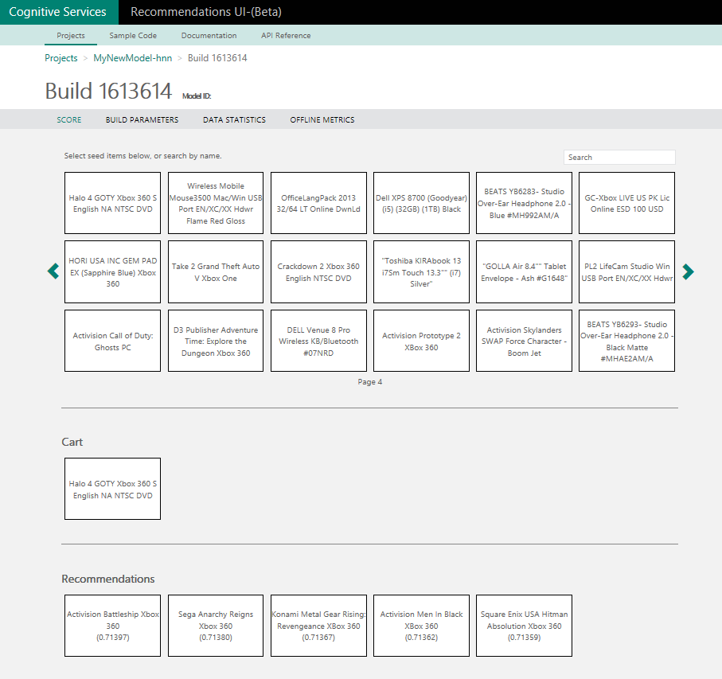
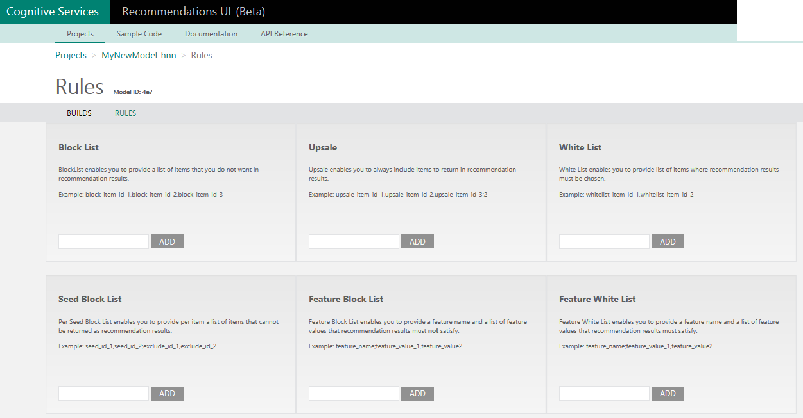

# cognitive-service-recommendation
Azure Cognitive Service Recommendations API repo

## Cognitive Service Recommendations API  
Hackfest team implemented and evaluated the entire recommendation process during Hackfest.  

[Cognitive Service Recommendations API](https://azure.microsoft.com/en-us/services/cognitive-services/recommendations/)  

Recommendations API provides three main recommendations.  

1. Frequently Bought Together (FBT) Recommendations  
In this scenario the recommendations engine will recommend items that are likely to be purchased together in the same transaction with a particular item.  
2. Item to Item Recommendations  
A common scenario that uses this capability, is "people who visited/clicked on this item, also visited/clicked on this item".  
3. Customer to Item Recommendations  
Given a customer's prior activity, it is possible to recommend items that the customer may be interested in.  

[Recommendations document](https://www.microsoft.com/cognitive-services/en-us/recommendations/documentation)  

## Recommendations API implementation process  
Add "Cognitive Services APIs" in Azure Portal and create API Type as "Recommendations". After it is deployed, check the API key of the service.  

The Recommended API implementation process is performed in the following procedures:  
- Create a Model  
- Add a catalog file  
- Add a usage file  
- Trigger a build for the Model  
- Get a recommendation based on a pair of items  

## Create a Model  
Create a model that contains the configuration and data to be recommended. To generate the model using the SDK, the Hackfest team referenced the project created in C# and proceeded to refer to the code published in github.  

[Cognitive-Recommendations-Windows github repo](https://github.com/Microsoft/Cognitive-Recommendations-Windows)  

```
public static string CreateModel(string modelName)
{
    string modelId;
    Console.WriteLine("Creating a new model {0}...", modelName);
    ModelInfo modelInfo = recommender.CreateModel(modelName, "MSStore");
    modelId = modelInfo.Id;
    Console.WriteLine("Model '{0}' created with ID: {1}", modelName, modelId);
    return modelId;
}
```

Create the model needed for recommendation, and return the Build ID. For reference, this process can be used to upload and build basic models and data using the SDK as well as the Recommendations UI.  

## Add a catalog file  
After creating the model, upload the data for the recommendation. The advantage of the Cognitive Service Recommendations API is that you only need to upload data to fit structure.  

[Collecting Data to Train your Model](https://docs.microsoft.com/en-us/azure/cognitive-services/cognitive-services-recommendations-collecting-data)  

Catalog file structure  

Without features:  

Item Id|Item Name|Item Category|Description
---|---|---|---|
AAA04294|Office Language Pack Online DwnLd|Office| 
AAA04303|Minecraft Download Game|Games| 
C9F00168|Kiruna Flip Cover|Accessories| 

With features:  

Item Id|Item Name|Item Category|Description|Features list
---|---|---|---|---|
AAA04294|Office Language Pack Online DwnLd|Office| |softwaretype=productivity, compatibility=Windows
AAA04303|Minecraft Download Game|Games| |compatibility=iOS, agegroup=all
C9F00168|Kiruna Flip Cover|Accessories| |hardwaretype=mobile

## Feature and Cold Start  
Recommendation service is a statistical service that recommends based on past sales (inquiry) history. However, if a new product is listed or a product that has never been sold, it will not be exposed to these standards. If you provide the appropriate features for these products, the recommendation engine will identify the appropriate correlations and use them for recommendations in cold start situations. 

[Why add features to the catalog](https://docs.microsoft.com/en-us/azure/cognitive-services/cognitive-services-recommendations-collecting-data#why-add-features-to-the-catalog)  

## Usage file structure  

Usage Format details:  

User Id|Item Id|Time|Event
---|---|---|---|
00037FFEA61FCA16|288186200|2015/08/04T11:02:52|Purchase  
0003BFFDD4C2148C|297833400|2015/08/04T11:02:50|Purchase  
0003BFFDD4C2118D|297833300|2015/08/04T11:02:40|Purchase  
00030000D16C4237|297833300|2015/08/04T11:02:37|Purchase  
0003BFFDD4C20B63|297833400|2015/08/04T11:02:12|Purchase  
00037FFEC8567FB8|297833400|2015/08/04T11:02:04|Purchase  

Usage has an Event item.  
- Click  
- RecommendationClick  
- AddShopCart  
- RemoveShopCart  
- Purchase  
  

## Upload Catalog and Usage file
This document covers the process of using sample data.  

```
public static long UploadDataAndTrainModel(string modelId, BuildType buildType = BuildType.Recommendation)
{
    long buildId = -1;

    // Import data to the model.            
    var resourcesDir = Path.Combine(Path.GetDirectoryName(Assembly.GetExecutingAssembly().Location), "Resources");
    Console.WriteLine("Importing catalog files...");

    int catalogFilesCount = 0;
    foreach (string catalog in Directory.GetFiles(resourcesDir, "catalog*.csv"))
    {
        var catalogFile = new FileInfo(catalog);
        recommender.UploadCatalog(modelId, catalogFile.FullName, catalogFile.Name);
        catalogFilesCount++;
    }

    Console.WriteLine("Imported {0} catalog files.", catalogFilesCount);


    Console.WriteLine("Importing usage files...");
    int usageFilesCount = 0;
    foreach (string usage in Directory.GetFiles(resourcesDir, "usage*.csv"))
    {
        var usageFile = new FileInfo(usage);
        recommender.UploadUsage(modelId, usageFile.FullName, usageFile.Name);
        usageFilesCount++;
    }

    Console.WriteLine("Imported {0} usage files.", usageFilesCount);

    #region training
    // Trigger a recommendation build.
    string operationLocationHeader;
    Console.WriteLine("Triggering build for model '{0}'. \nThis will take a few minutes...", modelId);
    if (buildType == BuildType.Recommendation)
    {
        buildId = recommender.CreateRecommendationsBuild(modelId, "Recommendation Build " + DateTime.UtcNow.ToString("yyyyMMddHHmmss"),
                                                             enableModelInsights: false,
                                                             operationLocationHeader: out operationLocationHeader);
    }
    else
    {
        buildId = recommender.CreateFbtBuild(modelId, "Frequenty-Bought-Together Build " + DateTime.UtcNow.ToString("yyyyMMddHHmmss"),
                                             enableModelInsights: false,
                                             operationLocationHeader: out operationLocationHeader);
    }

    // Monitor the build and wait for completion.
    Console.WriteLine("Monitoring build {0}", buildId);
    var buildInfo = recommender.WaitForOperationCompletion<BuildInfo>(RecommendationsApiWrapper.GetOperationId(operationLocationHeader));
    Console.WriteLine("Build {0} ended with status {1}.\n", buildId, buildInfo.Status);

    if (String.Compare(buildInfo.Status, "Succeeded", StringComparison.OrdinalIgnoreCase) != 0)
    {
        Console.WriteLine("Build {0} did not end successfully, the sample app will stop here.", buildId);
        Console.WriteLine("Press any key to end");
        Console.ReadKey();
        return - 1;
    }

    // Waiting  in order to propagate the model updates from the build...
    Console.WriteLine("Waiting for 40 sec for propagation of the built model...");
    Thread.Sleep(TimeSpan.FromSeconds(40));

    // The below api is more meaningful when you want to give a certain build id to be an active build.
    // Currently this app has a single build which is already active.
    Console.WriteLine("Setting build {0} as active build.", buildId);
    recommender.SetActiveBuild(modelId, buildId);
    #endregion

    return buildId;
}
```

## About Recommendation FBT(frequently bought together)  

Build Options -Set Build Type  
In the Hogangnono project, the Build Type set "Recommendations".  

[Build types and model quality](https://docs.microsoft.com/en-us/azure/cognitive-services/cognitive-services-recommendations-buildtypes)  

Build Type FBT can not provide cold start. It is recommended only for historical usage data.  
Build Type FBT Recommendation allows you to provide I2I(item-to-item) and U2I(user-to-item) (EnableU2I settings) and features (useFeaturesInModel settings) for cold item processing.  

After completing the model build by above code and uploading the catalog and usage files, then you can now make recommendations.  

## I2I(item-to-item) and U2I(user-to-item) call  
Call I2I with C#  

```
// Get item to item recommendations. (I2I)
Console.WriteLine();
Console.WriteLine("Getting Item to Item 5C5-00025");
const string itemIds = "5C5-00025";
var itemSets = recommender.GetRecommendations(modelId, buildId, itemIds, 6);
if (itemSets.RecommendedItemSetInfo != null)
{
    foreach (RecommendedItemSetInfo recoSet in itemSets.RecommendedItemSetInfo)
    {
        foreach (var item in recoSet.Items)
        {
            Console.WriteLine("Item id: {0} \n Item name: {1} \t (Rating  {2})", item.Id, item.Name, recoSet.Rating);
        }
    }
}
else
{
    Console.WriteLine("No recommendations found.");
}
```

Call U2I with C#  

```
// Now let's get a user recommendation (U2I)
Console.WriteLine();
Console.WriteLine("Getting User Recommendations for User: 0003BFFDC7118D12");
string userId = "0003BFFDC7118D12";
itemSets = recommender.GetUserRecommendations(modelId, buildId, userId, 6);
if (itemSets.RecommendedItemSetInfo != null)
{
    foreach (RecommendedItemSetInfo recoSet in itemSets.RecommendedItemSetInfo)
    {
        foreach (var item in recoSet.Items)
        {
            Console.WriteLine("Item id: {0} \n Item name: {1} \t (Rating  {2})", item.Id, item.Name, recoSet.Rating);
        }
    }
}
else
{
    Console.WriteLine("No recommendations found.");
}
```

## Example code called with node.js  
As of February 2017, using the node.js, the official SDK was not available and we tested using the "API specification".  

[I2I / Get item-to-item recommendations](https://westus.dev.cognitive.microsoft.com/docs/services/Recommendations.V4.0/operations/56f30d77eda5650db055a3d4)  
[U2I / Get user-to-item recommendations](https://westus.dev.cognitive.microsoft.com/docs/services/Recommendations.V4.0/operations/56f30d77eda5650db055a3dd)  

To consume API Testing console, you can use sample code provided testing here, but during the hackfest, team used "[Request NPM Package](https://www.npmjs.com/package/request)".  

[hackfest cognitive-service-recommendation code](https://github.com/hnn-project/cognitive-service-recommendation/tree/master/nodejs)  

```
/**
 * Cognitive service recommendation example
 * - Getting recommendation items with specific items.
 */
const request = require('request');

// API configurations
const API_URL = '{YOUR API URL WITHOUT PARAMETERS}';
const COGNITIVE_API_KEY = '{YOUR API KEY}';
const BUILD_ID = '{YOUR BUILD ID}';

// Item configurations
const ITEMS = [/* {TARGET ITEMS TO GET RECOMMENDATIONS} ex)'FKF-00829','C3T-00001'*/];
const NUMBER_OF_RESULTS = 5;
const MINIMAL_SCORE = 0;
const INCLUDE_METADATA = false;

request({
    method: 'GET',
    url: API_URL,
    qs: {
        'buildId': BUILD_ID,
        'itemIds': ITEMS.join(','),
        'numberOfResults': NUMBER_OF_RESULTS,
        'includeMetadata': INCLUDE_METADATA,
        'minimalScore': MINIMAL_SCORE
    },
    headers: {
        'Ocp-Apim-Subscription-Key': COGNITIVE_API_KEY
    }
}, (err, response, body) => {
    if (err) {
        console.error('Request failed', err);
        process.exit(1);
    }

    console.log(JSON.parse(body));
});
```

In this way, you can get a recommendation using the Request from node.js.  

References link: [Recommendations API - UI](https://docs.microsoft.com/en-us/azure/cognitive-services/cognitive-services-recommendations-ui-intro)  

## Recommendation UI  
You can get the recommendation by using the SDK like above, and you can also use the Recommendation UI.  

  

Recommendation UI supports basic function of SDK and can be scored enough visually. It has making a good development / debugging tool.  

[Recommendations API - UI](https://docs.microsoft.com/en-us/azure/cognitive-services/cognitive-services-recommendations-ui-intro)  

It is expected that the recommendation service will take a long time to evaluate and it will take a lot of time to check the accuracy and QA, but it is expected that the provided Recommendation UI tools will relieve this difficulty much.  

## Batch scoring  
It was also can be build to handle batches easy way.  

[Get recommendations in batches](https://docs.microsoft.com/en-us/azure/cognitive-services/cognitive-services-recommendations-batch-scoring)  

If you run the batch job with the batch process on the blob storage input, it runs asynchronously and when the execution is completed, the result is created in the specified output blob. Hogangnono will use this batch scoring for the purpose of U2I, etc., and considering to optimize U2I requests for each user by inserting user-specific items that are generated by U2I in AWS RDS.  

## Apply Business rule  
If a new listing needs to be registered and promoted, or if cross-sell / up-sell is required based on profit model, or if you implement a direct referral service, you should have developed additional logic and management tools for the block list, white list, upsell, and so on. The advantage of the Cognitive Service Recommendations API is that it provides all of these concerns in SDK APIs or UIs, providing flexible promotions and management capabilities.  

[Recommendations - Create business rule](https://westus.dev.cognitive.microsoft.com/docs/services/Recommendations.V4.0/operations/577d91f77270320f24da258e)  

  

In the case of start-up, Recommendations API provides basically an advanced recommendation service and various functions necessary for model creation and recommendation data management.  
 